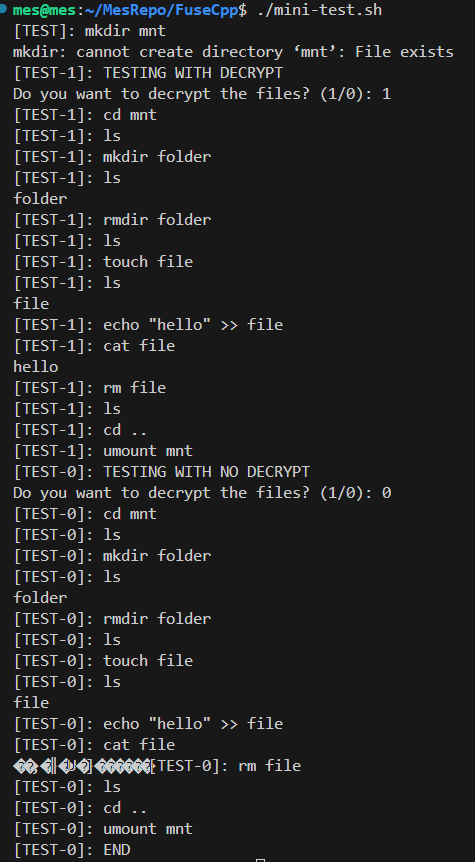

# intsall tool

```
sudo apt-get update
sudo apt-get install gcc fuse libfuse-dev make cmake
sudo apt-get install libssl-dev
```

# Compiling

```
mkdir mnt
mkdir build && cd build
cmake ..
cmake --build .
```

# Brief

This is an very simple filesystem made by FUSE. support basic operations such as 

- Create, read, and write files.
- Open and close files.
- Create and remove directories.
- List directory contents.

also, it Integrating AES-256-CBC Encryption for the write and read operations, thus the file was encrypted.

There is an mini-test script to demo the encryption and the basic operations

```
./mini-test.sh
```

